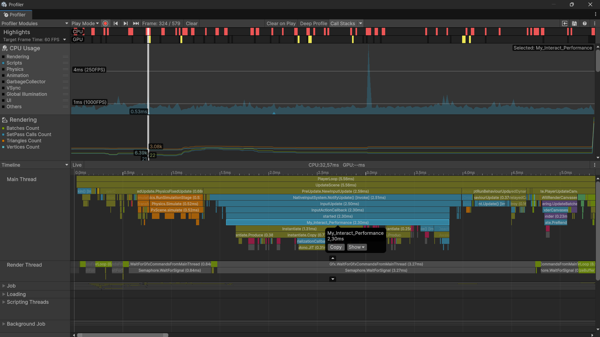
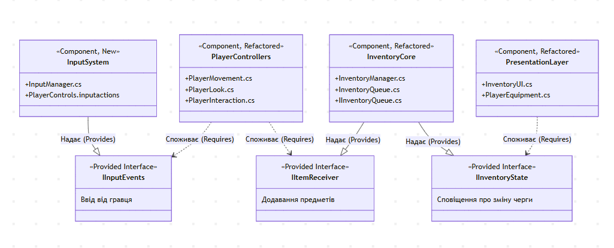
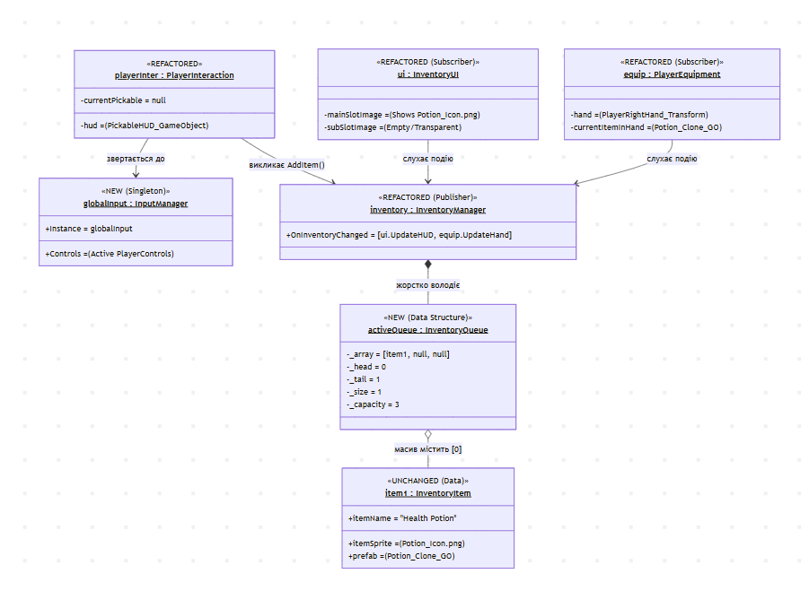
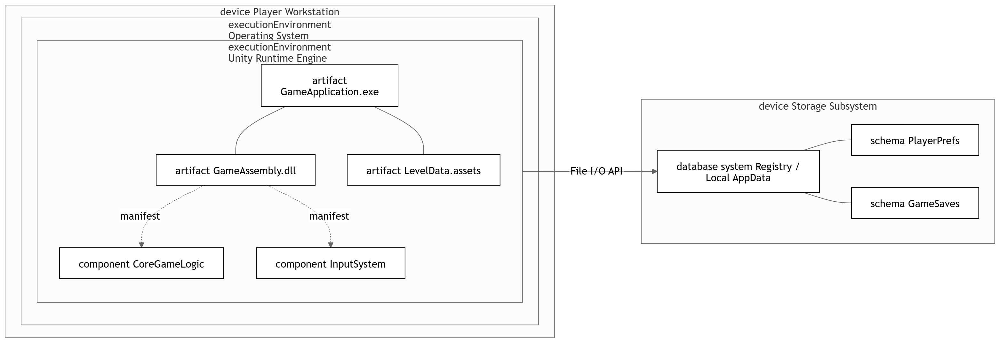
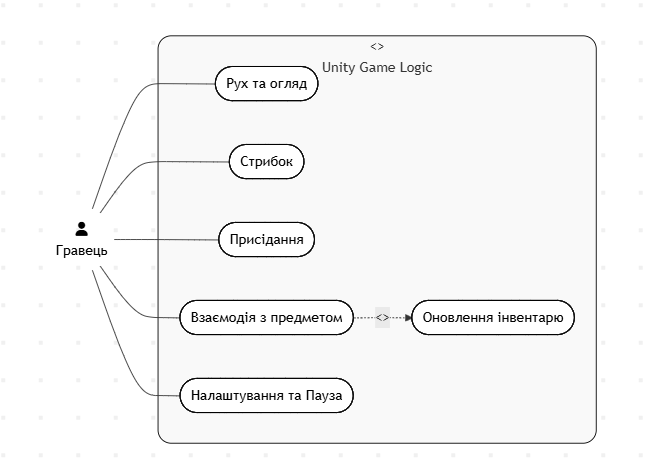
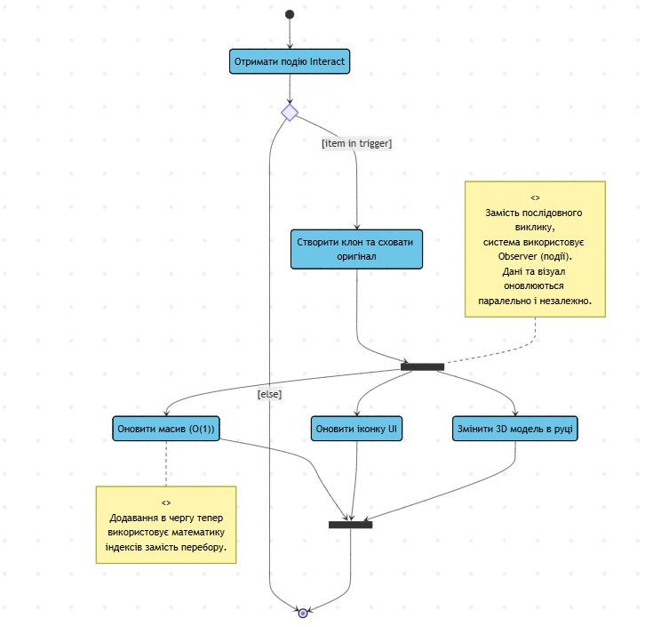
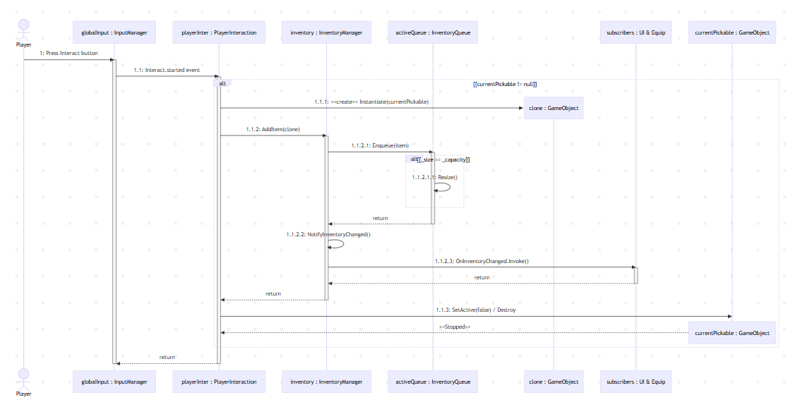

# Lab1_OOP
# Звіт з виконання практичного завдання: Рефакторинг та UML-моделювання програмної системи

## 1. Вступ
Для виконання даного завдання було обрано проєкт, пов'язаний із рефакторингом legacy-коду відеогри, розробленої на рушії Unity. Початковий стан проєкту характеризувався високим рівнем зв'язності (tight coupling), змішуванням бізнес-логіки з логікою представлення (UI) та неефективним використанням системних ресурсів (постійне опитування пристроїв вводу). 

**Мета роботи:** покращити object-oriented design проєкту, підвищити його гнучкість, розділити відповідальність між компонентами та задокументувати зміни за допомогою UML-моделювання з виділенням відрефакторених частин.

---

## 2. Аналіз існуючого коду та виявлені проблеми
У попередній версії програми було виявлено наступні архітектурні недоліки:
1. **Порушення SRP (Single Responsibility Principle):** Клас `PlayerMovement` одночасно відповідав за фізику переміщення гравця та за зчитування натискань клавіш. Клас `Inventory` самостійно оновлював графічний інтерфейс (UI).
2. **Висока зв'язність (Tight Coupling):** Бізнес-логіка була жорстко прив'язана до конкретних класів UI, що унеможливлювало тестування інвентарю без наявності Canvas на сцені.
3. **Неефективність алгоритмів:** При додаванні предметів в інвентар використовувався лінійний пошук вільного слота зі складністю O(n), а перевірка вводу виконувалася щокадру.

---

## 3. Запропоновані зміни та реалізація (Рефакторинг)
Для вирішення виявлених проблем було застосовано наступні рішення:

1. **Впровадження InputManager (Патерн Singleton):**
   Логіку зчитування вводу повністю винесено в окремий інфраструктурний компонент `InputManager`. Тепер контролери гравця (`PlayerMovement`, `PlayerInteraction`) та UI (`PauseMenu`) лише підписуються на глобальні події (наприклад, `Interact.performed`).
2. **Розподіл логіки та UI (Патерн Observer):**
   Клас `InventoryManager` перетворено на видавця подій. При зміні даних він генерує подію `OnInventoryChanged`. Класи `InventoryUI` та `PlayerEquipment` виступають слухачами, що забезпечує низьку зв'язність (Loose Coupling).
3. **Оптимізація структур даних:**
   Масив інвентарю інкапсульовано в клас `InventoryQueue`. Завдяки математичному розрахунку вказівників `_head` та `_tail`, складність додавання елемента зменшено до O(1).
4. **Unit-тестування:**
   Для перевірки збереження логіки було написано Unit-тести (з використанням Unity Test Framework), які перевіряють коректність додавання елементів у `InventoryQueue` та спрацювання подій `InputManager` без запуску самої гри.

---

## 4. Аналіз коду за принципами ООП та архітектури
Запропонований рефакторинг суворо дотримується сучасних стандартів інженерії програмного забезпечення:
* **DRY (Don't Repeat Yourself):** Дублювання коду зчитування вводу в різних класах усунуто; логіка зосереджена в `InputManager`.
* **KISS (Keep It Simple, Stupid):** Замість складних перевірок стану інтерфейсу зсередини інвентарю, використано простий делегат (Action), який викликається при зміні даних.
* **SOLID - SRP:** Кожен клас тепер має лише одну причину для зміни.
* **Інкапсуляція:** Внутрішня структура масиву інвентарю прихована від системи взаємодії; доступ надається виключно через метод `AddItem()`.

## 4.1 Час виконання функції Interact() для початкового коду та коду після рефакторингу:
**Початковий код**

**Код після рефакторингу**

**Наочно бачимо, що час виконання функції після рефакторингу зменшився, що доводить покращення коду**

---

## 5. UML Моделювання та візуалізація змін
Для документування архітектури та відображення внесених змін було побудовано набір UML-діаграм. Зміни виділені за допомогою UML-нотаток (Notes), стереотипів (`<<NEW>>`, `<<REFACTORED>>`), кольорового кодування та доріжок (Swimlanes).

### 5.1. Структурні діаграми

**Class Diagram:** Відображає нову ієрархію класів, виділяючи патерни Singleton та Observer. Показує відсутність прямих залежностей між логікою та UI.

**Component Diagram:** Використовує "Lollipop-нотацію" (Provided/Required Interfaces) для демонстрації слабко зв'язаних модулів (Presentation Layer, Player Controllers, Infrastructure).

**Object Diagram:** Показує зріз пам'яті (snapshot) під час виконання (Runtime) у момент підбору предмета, ілюструючи стан екземплярів класів та масивів.

**Deployment Diagram:** Демонструє фізичну топологію розміщення артефактів (`.exe`, `.dll`, `.assets`) у середовищі виконання Unity Runtime та їх взаємодію з файловою системою (PlayerPrefs).

### 5.2. Поведінкові діаграми

**Use Case Diagram:** Описує функціонал системи з точки зору гравця, демонструючи відношення `<<include>>` та `<<extend>>` для механік взаємодії та UI.

**Activity Diagram:** Моделює алгоритм підбору предмета. Використано Swimlanes для демонстрації розподілу відповідальності (SRP) та вузли Fork/Join для показу паралельного оновлення UI (Observer).

**Sequence Diagram:** Розкриває взаємодію об'єктів у часі (lifelines, activations) при натисканні кнопки взаємодії, включаючи створення клонів (`<<create>>`) та знищення оригіналів об'єктів.

**State Diagram:** Описує реактивну поведінку контролера гравця, зміну складних (вкладених) станів руху та присідання у відповідь на події системи вводу.

---

## 6. Документація коду
У рамках проєкту було налаштовано автоматичну генерацію документації за допомогою **Doxygen**. Згенерована документація включає опис усіх відкритих методів, класів та подій. 
Для зручності перегляду, HTML-версію документації інтегровано в репозиторій та налаштовано автоматичний деплой через **GitHub Actions** на **GitHub Pages**, що дозволяє ознайомитися з API проєкту без необхідності клонування вихідного коду.
Посилання на сайт з документацією: [https://tironosauroo.github.io/Lab1_OOP/index.html](https://tironosauroo.github.io/Lab1_OOP/index.html)

## Висновок
В результаті виконання завдання було успішно проведено рефакторинг legacy-проєкту. Перехід до подієво-орієнтованої архітектури та застосування патернів проєктування дозволили значно знизити зв'язність коду, покращити його читабельність та підготувати систему до легкого масштабування. Побудовані UML-діаграми чітко документують ці архітектурні рішення та забезпечують прозорість внесених змін для подальшої підтримки.
